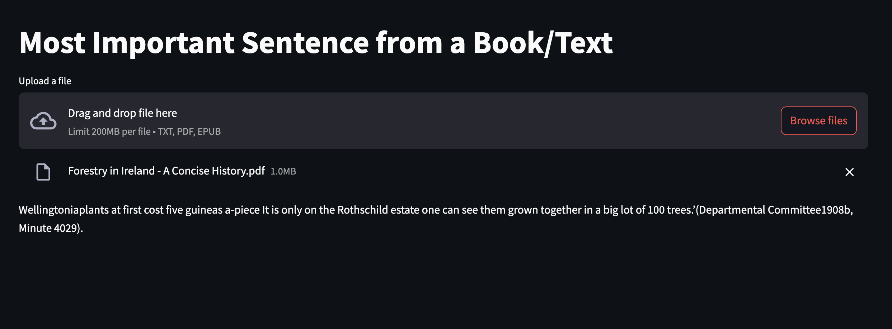

# Get one sentence from PDF and eBook

<div align="center">
  
</div>

## Overview

This application allows users to upload PDF, EPUB, or TXT files and automatically generates a summary of the most important sentence or section. It uses advanced natural language processing (NLP) techniques to analyze and extract key insights from the document.

## Features

- **Upload Support**: Users can upload files in `.pdf`, `.epub`, or `.txt` formats.
- **Text Summarization**: Summarizes the content using NLP techniques, specifically the LSA (Latent Semantic Analysis) method.
- **Simple Interface**: Easy-to-use interface built with Streamlit.

## Technologies and Libraries Used

- **Python**: The core programming language for the app.
- **Streamlit**: For building an interactive web application.
- **pdfplumber**: For PDF text extraction.
- **ebooklib**: For EPUB file parsing.
- **Sumy**: For summarization using LSA (Latent Semantic Analysis).
- **nltk**: For tokenization and handling natural language processing tasks.

## How It Works

1. Upload a file (`.pdf`, `.epub`, or `.txt`).
2. The app extracts the text from the file.
3. It processes the text and generates a concise summary based on the content.
4. View the extracted text and the summary directly on the web interface.

## Getting Started

1. Clone the repository:
    ```bash
    git clone https://github.com/one_sent
    ```
2. Install the required dependencies:
    ```bash
    pip install -r requirements.txt
    ```
3. Run the app:
    ```bash
    streamlit run app.py
    ```
